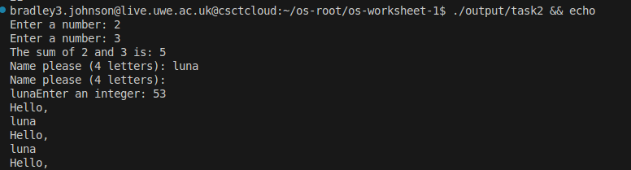

# Worksheet 1 - Arrays and I/O

### Purpose

- To provide an input to print the user's name
- Print the user's name with a welcome message as many times as the user asked within a limit
- Use a limit of 50-100
- Assert if user inputs are within that range
- Create a list of 1-100, incrementing and add the entire list together like a factorial
- Add two numbers and output

### Things learnt

- Loops

  ```asm
  printLoop: ; loop a welcome message and the user's name
          mov eax, welcome
          call print_string

          mov eax, 0

          mov eax, nameIn ; send the user's name into eax and then print it
          call print_string
          call print_nl ; new line for matting
          loop printLoop
  ```
- User input
- Basic input validation
- Basic compare statements


## Run Locally

- Clone the project

~~~bash
  git clone https://gitlab.uwe.ac.uk/
~~~

- cd into the directory

~~~bash
  cd OS-worksheet1
~~~

### Compile tasks

**All**

```bash
make all
```

**One**

```bash
make task{x}
```

### Understanding

#### Array

```asm
arrayLen equ 100 ; array length for 100 exactly - this is for the loop to iterate over the array list
array1 resb 100 ; resb 100 = one byte * 100, max int of 255 (highest bit = 128)
```

#### Loops

```asm
; The user input is in a loop to keep asking user for a new input until they get something valid
; Incorrect flow: userInp > IsError > userInp
; Correct flow: userInp > rest of program

;....
; User input
  cmp eax, 50 ; compare eax (userinput) against 50
  jl isError ; <50 then jmp to isError and print an error code
  cmp eax, 100 ; >100, too high
  jg isError ; error code
```

**Run tasks**

(1 = compile + run, 0 = compile only)

```bash
./compiling <taskNo> 1
```

## Outputs

### Task1


### Task 2



## Code snippets

### 50-100 user num validation loop


## Contributing

Contributions are always welcome!

See `contributing.md` for ways to get started.

Please adhere to this project's `code of conduct`.

## License

[MIT](https://choosealicense.com/licenses/mit/)
