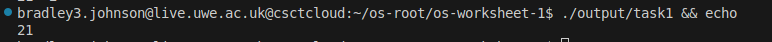
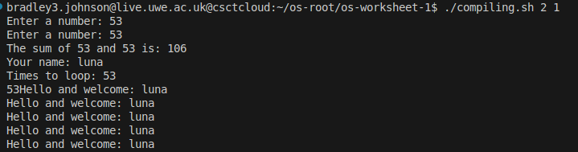
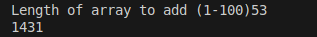

# Worksheet 1 - Arrays and I/O

### Purpose

- To provide an input to print the user's name
- Print the user's name with a welcome message as many times as the user asked within a limit
- Use a limit of 50-100
- Assert if user inputs are within that range
- Create a list of 1-100, incrementing and add the entire list together like a factorial
- Add two numbers and output

### Things learnt

- Loops

  ```nasm
  printLoop: ; loop a welcome message and the user's name
          mov eax, welcome
          call print_string

          mov eax, 0

          mov eax, nameIn ; send the user's name into eax and then print it
          call print_string
          call print_nl ; new line for matting
          loop printLoop
  ```
- User input

```nasm
read_string: ; added function to read a string and store into the passed pointer
	enter	0,0
	pusha
	pushf

	push	eax
	push    dword string_format
	call	_scanf ; uses scanf extern to get string
	pop	ecx
	pop	ecx

	popf
	popa
	leave
	ret
```

```nasm
mov eax, nameIn ; nameIn < variable to store the user input
call read_string ; how to read the string
```

- Basic input validation

```nasm
cmp eax, 50
jl isError
cmp eax, 100
jg isError
```

- Basic compare statements

```nasm
cmp eax, 50
jl isError
cmp eax, 100
jg isError
```

- Sending input to an assembly file and parsing it to fix the stack task

  ```python
  def task1():
      # compiled regex to find (1-100)num
      p = re.compile(r'\(1-100\)\d+')
      output = []
      for i in range(50, 101):
          x = sp.run(['output/task2'], input=f'{i}\n{i}\nluna\n53\n{i}', text=True, capture_output=True)
          # print(x.stdout);
          # print(x.stderr)
          # print(x.returncode)
          num = p.findall(x.stdout)[0].split(')')[1].strip()

          # input()
          output.append(num)
      return output
  ```

## Run Locally

- Clone the project

```bash
git clone https://gitlab.uwe.ac.uk/
```

- cd into the directory

```bash
cd OS-worksheet1
```

### Compile tasks

**All**

```bash
make all
```

**One** - replace {x} with num e.g. task2

```bash
make task{x}
```

---

**Testing Stack sum**

```bash
python3 arrayTester.py
```

Open the test.webp and this should display if the array sum is correct. If there are only 2 visible lines a blue at a constant 0, and a brownish curve, then it is correct.

### Understanding

#### Array

```nasm
arrayLen equ 100 ; array length for 100 exactly - this is for the loop to iterate over the array list
array1 resb 100 ; resb 100 = one byte * 100, max int of 255 (highest bit = 128)
```

#### Loops

```nasm
; The user input is in a loop to keep asking user for a new input until they get something valid
; Incorrect flow: userInp > IsError > userInp
; Correct flow: userInp > rest of program

;....
; User input
  cmp eax, 50 ; compare eax (userinput) against 50
  jl isError ; <50 then jmp to isError and print an error code
  cmp eax, 100 ; >100, too high
  jg isError ; error code
```

#### Fixing the array issue

I created a python file at arrayTester.py this graphs the output of the array task against a correct math formula to see if it's correct. Using this, I found that skipping to the stack task code works perfectly. But the task1 causes it to fail?

To attempt to fix this, I added a -204 to eax. This when tested with changing numbers in the input caused it to still break. So the user input in the first task was overlapping into the final task (array task). So I tried moving 0 into the variables storing the results, and input. This worked, there was a difference of 0 between the math solution and the code.

**Quickly explaining the python code:**

- There are 2 functions, one for the nasm with a jmp to stack, and one without
- Use subprocess to open the file and pass input to
- Automatically send an input to each required input
- Parse the output and graph it
- For loop the program incrementing the number from 50-100
- Graph it, comparing the program against a formula

What did I change? Just added the following:

```nasm
mov eax, 0 ; setting eax to 0 so I don't have to define what type to move into the variables (e.g. word, byte etc)
mov ebx, 0
mov [result], eax
mov [integer1], eax
mov [integer2], eax
```

The below was it not working. The blue line demonstrates the difference between the correct and my program's output for the array sum task.


---

**This was the corrected code graph. Working as intended**


---

**Run tasks**

(1 = compile + run, 0 = compile only)

```bash
./compiling <taskNo> 1
```

## Outputs

### Task1



### Task 2





### Code snippets

50-100 user num validation loop


## Contributing

Contributions are always welcome!

See `contributing.md` for ways to get started.

Please adhere to this project's `code of conduct`.

## License

[MIT](https://choosealicense.com/licenses/mit/)
