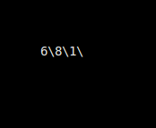
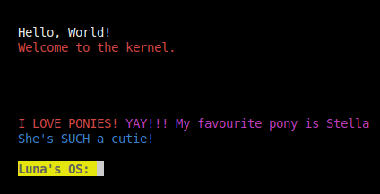
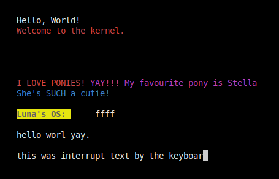

# Worksheet 2 - Arrays and I/O

### Purpose

- To emulate and run a BareBones OS using assembly and C
- Using hardware addresses to interact with the system
- Writing to the screen

### Minor thing

With the makefile to run, use "make tmux". 

Also, running curses has been adapted to -display curses, due to running inside a docker container I created.
This docker container was created with the purpose of connecting vscode and having all the requirements to run the os, without needing to install anything on the host machine.
To also bypass UWE CSCT timeouts as well.

Given the issues with cpu's being maxed out by people's qemu instances, I've added a hlt instruction to prevent usage when not actively used.
This massively reduces the cpu usage of the qemu instances. As it's not constantly running as fast as it can.

Docker image provided at: https://hub.docker.com/repository/docker/lunachocken/os_uwe/

```yml
services:
  vscode:
    image: lunachocken/os_uwe
    tty: true
    stdin_open: true
    ports:
      - 5000:22 # ssh
    volumes:
      - code:/home/luna/code_volume
volumes:
  code:
```

running: 
```bash
sudo docker compose up -d
 ```


### Things learnt

- Basic API means extensions are a lot easier

```c

// This code resets the position variables, the cursor and overwrites the buffer with spaces to clear the screen
extern void terminal_initialize(void)
{
    // keep track of the row and column such that it's easier to keep track of the cursor to write
    terminal_row = 0;
    terminal_column = 0;
    terminal_color = vga_entry_color(VGA_COLOR_LIGHT_GREY, VGA_COLOR_BLACK);
    terminal_buffer = VGA_MEMORY;
    for (size_t y = 0; y < VGA_HEIGHT; y++)
    {
        for (size_t x = 0; x < VGA_WIDTH; x++)
        {
            const size_t index = y * VGA_WIDTH + x;
            terminal_buffer[index] = vga_entry(' ', terminal_color);
        }
    }
}
```
- Hardware addresses

```nasm
  fb  equ 0xb8000 ; frame buffer address
```
Sending data to that address prints to the screen
Using ascii codes and some bits to denote the colour. 
It's a 16 bit type. 8 bits for the character, 4 for the background, and 4 for the foreground.


- Changing the cursor

```c
// uses a assembly file wrapped in a c function to move the cursor
void fb_move_cursor(unsigned short pos)
{
    outb(FB_COMMAND_PORT, FB_HIGH_BYTE_COMMAND);
    outb(FB_DATA_PORT, ((pos >> 8) & 0x00FF));
    outb(FB_COMMAND_PORT, FB_LOW_BYTE_COMMAND);
    outb(FB_DATA_PORT, pos & 0x00FF);
}
```

- Serial communication

```c
// Uses the io.h library to write to the serial port
// Test function
extern "C" void write_serialtest()
{
    const char *buf = "I love ponies!\nYAY!\nMy favourite pony is Stella\nA custom oc!";
    write_string_serial(buf);
}
```

- Externs

```c
// externs to allow other files to use the functions within another
extern "C" void fb_write_cell(unsigned int i, char c, unsigned char fg, unsigned char bg);
```


## Run Locally

- Clone the project

```bash
git clone https://gitlab.uwe.ac.uk/
```

- cd into the directory

```bash
cd OS-worksheet1
```

### Compile tasks

Compile OS

```bash
make os.iso
```

**Telnet** 
```bash
make telnet
```

**Serial**

```bash
make serial
```

---


## Outputs

### Print to screen

The below image contains tmux, which is a terminal multiplexer, with the serial output on the left and the telnet output on the right.

This means, I can use the serial, and qemu control at the same time. Plus the tmux session creates everything automatically with the script. ./tmux.sh

```bash
make tmux
```


### Task 2 - C funcs in assembly
```For this task you should read chapter 3 of the OS book and extend your kernel so that it can call C
functions. As well as implementing the function sum_of_three, outlined in the chapter, you should
implement and test at least two other C functions, although what those functions do is up to you.
Exend your makefile to work with this new structure, in particular, add support to transfer control to
C from your loader.asm, developed in task 1.
```

This code below pushes arguments three separate c functions, then calls a display function to show the output on the screen.
There's also a nested for loop designed to give time to show the output.

```asm
extern sum_of_three;
		extern mult_of_three;
		extern sub_num;

		extern terminal_initialize
		extern terminal_putc
		call terminal_initialize

		push 1
		push 2
		push 3
		call sum_of_three

		extern asm_display_num
		push eax
		call asm_display_num
		push '\\'
		call terminal_putc

		push 1
		push 2
		push 4
		call mult_of_three
		push eax
		call asm_display_num
		push '\\'
		call terminal_putc

		push 1
		push 2
		call sub_num
		push eax
		call asm_display_num
		push '\\'
		call terminal_putc

		; gives time to show the output
		mov eax, 120
		sleep2:
			mov ecx, 499999
			sleep:
				loop sleep
			sub eax, 1
			CMP eax, 0
			JNE sleep2
```

#### Output png
Add, Multiply, Subtract




### Task 3 - Framebuffer
```
For this task we are going to focus on adding some simple I/O, following chapter 4 of our OS book. An
OS, or any program, the lack of IO makes it pretty basic and the ability to interact with the world opens
up access to dynamically changing a programs behavour. The simplest form of I/O is the framebuffer
so we can display or output text to the console. In part 2 of the worksheet, we will explore the other
basic, but key I/O device, the keyboard.
```

We have a few functions used to display text on the screen. The code below is a simple example of how to write to the screen.

```c
// writes a string to the screen, strlen fetches the length to loop through
extern void terminal_writestring(const char *data)
{
    terminal_write(data, strlen(data));
}

// uses a common library I made to convert numbers to strings and then write them to the screen
extern void terminal_writeint(int data)
{
    char str[20];
    convert_num_to_string(data, str);
    
    terminal_writestring(str);
}

// This func, tests for enter, backspace and normal characters
// It also increments the row and column to keep track of the cursor
// Updating the cursor position with another function
extern void terminal_putc(char c);
```

### Output screen terminal:

Image of the terminal output



## Worksheet PT2

Keyboard input. (d was used to delete the entire line and thus can't be typed atm)



Serial output


## Contributing

Contributions are always welcome!

See `contributing.md` for ways to get started.

Please adhere to this project's `code of conduct`.

## License

[MIT](https://choosealicense.com/licenses/mit/)
